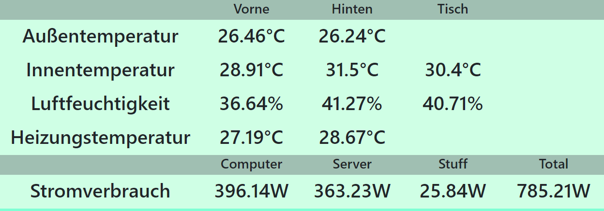

= Various Python scripts for a DIY smarthome solution
:toc: macro
:numbered: 1

toc::[]

== Quickstart
To clone the repo with all submodules:
....
git clone --recurse-submodules https://github.com/leonhess/smarthome
....

or if you pulled without the submodules you can pull them afterwards with
....
git submodule update --init
....

The backbone of all scripts is a https://www.influxdata.com/[InfluxDB] instance running. All the Sensor scripts write to the https://www.influxdata.com/[InfluxDB] instance,
while the website or a https://grafana.com/[Grafana] instance ist used to visualize the data.

Everything is supposed to run on python3.7, most things should run with older python3 versions, but ``raspi_cpu``
requires python3.7.

== Overview

.Script status
|===
|Name |required python modules |Dockerfile | Unit File

|website
a|
- influxdb
- flask
- MarkupSafe
- python-dateutil
| tested on Pi3B+
| probably broken

|ds18b20
a|
- influxdb
- w1thermsensor
| tested on PiZero
| probably broken

|dht22
a|
- influxdb
- Adafruit_DHT
| tested on PiZero
| probably broken

|hs110
a|
- influxdb
- pyHS100
| tested on Pi3B+
| probably broken

|raspi_cpu
a|
- influxdb
| only works on Pi3B+
| doesnt exist
|===


I run one central Pi3B+ with the Database and most of the scripts and then multiple PiZeros with
the temperature and humidity sensors. This can be scaled indefinetly.

All of the scripts are run in there own Docker container, which makes it easy to deploy new PiZeros
or update already running scripts.

.Setup
|===
|Name |Device |Services |Description

|Collectors
|2x Raspberry Pi Zero W
a|
- dht22
- ds18b20
|

|Pi 3
|Raspberry Pi 3B+
a|
- hs110
- website
- raspi_cpu
- jenkins slave
- telegraf
|

|Kubernetes Cluster
|3x Raspberry Pi 3B+
a|
- telegraf
|Currently does nothing

| x86 Machine
|AMD FX CPU
a|
- influxDB
- grafana
- jenkins
- ansible
- registry
- registry-browser
- telegraf
|Runs the heavy apps and stuff that doesnt run on ARM


|===

== InfluxDB
Quickly get a Docker container up and running with:

Create a Docker Volume for persistent Database storage:
....
docker volume create influxdb-storage
....

....
docker run \
  --name influxdb \
  --restart always \
  -d \
  -p 8086:8086 \
  -v influxdb-storage:/var/lib/influxdb \
  -v $PWD/influxdb.conf:/etc/influxdb/influxdb.conf:ro \
  influxdb:latest
....

- ``--name influxdb`` sets the name of the container
- ``-d`` detaches the container from the shell
- ``-p 8086:8086`` opens the influx specific port
- ``-v influxdb-storage:/var/lib/influxdb`` mount the internal data directory to the storage volume for persistent database storage
- ``-v $PWD/influxdb.conf:/etc/influxdb/influxdb.conf:ro`` runs Influx with the config in your current directory, leave out for default config

=== Run the Influx Shell
Start the Influx Container above, then run:
....
docker exec -it influxdb influx
....

== Telegraf
Quickly get a Docker container up and running:

....
docker run \
  -v $PWD/telegraf.conf:/etc/telegraf/telegraf.conf:ro \
  --restart always \
  --name=telegraf \
  -d \
  -h raspi-cluster-3 \
  -v /var/run/docker.sock:/var/run/docker.sock \
  -e HOST_PROC=/host/proc \
  -v /proc:/host/proc:ro \
  telegraf
....

But I also build my own Telegraf container with my custom Config baked in.

== Grafana
Quickly get a Docker container up and running:

Create a volume for the Grafana data, so it is persistent over container restarts.
....
docker volume create grafana-storage
....

Run the container
....
docker run \
  --name grafana \
  --restart always \
  -d \
  -p 3000:3000 \
  -v grafana-storage:/var/lib/grafana \
  grafana/grafana
....

== website
A python Flask to display various stats about the setup

==== Getting started

- Currently only displays temperature and humidity from the ``ds18b20``, ``dht22`` and ``hs110`` scripts.



- Things to implement:
1. Data of the other scripts
2. admin panel to change what is displayed

==== Docker

....
docker run --restart always -d --name=website -p 5000:5000 leonhess/website:latest
....

== ds18b20
reads ds18b20 sensors connected to a RaspberryPi

==== Getting started
Connect all your DS18B20s to the GPIO port ``4``.
Also don't forget to enable the 1wire bus (``sudo raspi-config``).

The ds18b20 sensors can run on different precisions. In the ``scripts`` directory edit the ``set_precision.py``
and run it once to write to the memory of the sensor. (The Memory of the sensor can only be written about 50k times
so be careful with writing to its memory)


|===
|Mode |Resolution |Conversion time

|9 bits
|0.5°C
|93.75 ms

|10 bits
|0.25°C
|187.5 ms

|11 bits
|0.125°C
|375 ms

|12 bits
|0.0625°C
|750 ms
|===

==== Config
For the DS18B20 sensors add their unique id in the "id" field and add
name of your choosing.

If you don't know the unique IDs of your DS18B20s you can run ``python3 get_ds18b20_ids.py``
which will print them out for you.

- ``influx_ip = "192.168.66.56"`` sets the IP of your InfluxDB Server or localhost if you run it on your RPi
- ``influx_port = "8086"`` sets the port of the InfluxDB Server, default is ``8086``.
- ``influx_database = "smarthome"`` sets the database name, default is ``smarthome``.
- ``influx_retention_policy = "2w"`` sets the retention policy, the amount of time until Influx discards your data, for infinite retention use ``"autogen"``

Possible retention intervals:
....
ns	nanoseconds (1 billionth of a second)
u or µ	microseconds (1 millionth of a second)
ms	milliseconds (1 thousandth of a second)
s	second
m	minute
h	hour
d	day
w	week
....

==== Docker
``cd`` into the ``dht22`` directory, then run:

....
docker build -t ds18b20 .

docker run --restart always -d --privileged --name=ds18b20 ds18b20
....

==== systemd
I supply a default unit file. For it to work you have to clone this repo into home directory of the user pirate
(``/home/pirate/``).
If you want to store the script in another location you just have to change the path to the
``smarthome_ds18b20.service``.

Copy the unit file ``smarthome_ds18b20.service`` to the correct directory:

````
sudo cp smarthome_ds18b20.service /lib/systemd/system/
````

Then set the right permissions on that file:

````
sudo chmod 644 /lib/systemd/system/smarthome_ds18b20.service
````

Then enable the service:
````
sudo systemctl daemon-reload
sudo systemctl enable smarthome_ds18b20.service
````

The script should now autostart on system startup.
It should also try to restart if it crashes.

you can start the script without rebooting with:

....
sudo systemctl start smarthome_ds18b20.service
....

If you want to check the status of the script:

``sudo systemctl status smarthome_ds18b20.service``


== dht22
Reads dht22 sensors connected to a RaspberryPi

==== Getting started
Connect one dht22 to a GPIO port of your choosing respectively.
Also don't forget to enable the 1wire bus (``sudo raspi-config``).

==== Config
For the dht22 sensors add the gpio pin which you connected it to and
add a name of your choosing.

- ``influx_ip = "192.168.66.56"`` sets the IP of your InfluxDB Server or localhost if you run it on your RPi
- ``influx_port = "8086"`` sets the port of the InfluxDB Server, default is ``8086``.
- ``influx_database = "smarthome"`` sets the database name, default is ``smarthome``.
- ``influx_retention_policy = "2w"`` sets the retention policy, the amount of time until Influx discards your data, for infinite retention use ``"autogen"``

Possible retention intervals:
....
ns	nanoseconds (1 billionth of a second)
u or µ	microseconds (1 millionth of a second)
ms	milliseconds (1 thousandth of a second)
s	second
m	minute
h	hour
d	day
w	week
....

==== Docker
``cd`` into the ``dht22`` directory, then run:

....
docker build -t dht22 .

docker run --restart always -d --name=dht22 --privileged dht22
....

==== systemd
I supply a default unit file. For it to work you have to clone this repo into home directory of the user pirate
(``/home/pirate/``).
If you want to store the script in another location you just have to change the path to the
``smarthome_dht22.service``.

Copy the unit file ``smarthome_dht22.service`` to the correct directory:

````
sudo cp smarthome_dht22.service /lib/systemd/system/
````

Then set the right permissions on that file:

````
sudo chmod 644 /lib/systemd/system/smarthome_dht22.service
````

Then enable the service:
````
sudo systemctl daemon-reload
sudo systemctl enable smarthome_dht22.service
````

The script should now autostart on system startup.
It should also try to restart if it crashes.

you can start the script without rebooting with:

....
sudo systemctl start smarthome_dht22.service
....

If you want to check the status of the script:

``sudo systemctl status smarthome_dht22.service``

== hs110
Reads TP.Link HS110 smart wallplugs.

==== Getting started
Setup all you ``HS110``'s with the Kasa App.
Then adjust the config to your needs and run the commands from the Docker section to get the container running.

==== Config
- ``influx_ip = "192.168.66.56"`` sets the IP of your InfluxDB Server
- ``influx_port = "8086"`` sets the port of the InfluxDB Server, default is ``8086``.
- ``influx_database = "smarthome"`` sets the database name, default is ``smarthome``.
- ``influx_retention_policy = "12w"`` sets the retention policy, the amount of time until Influx discards your data, for infinite retention use ``"autogen"``

Possible retention intervals:
....
ns	nanoseconds (1 billionth of a second)
u or µ	microseconds (1 millionth of a second)
ms	milliseconds (1 thousandth of a second)
s	second
m	minute
h	hour
d	day
w	week
....

==== Docker
``cd`` into the ``hs110`` directory, then run:

....
docker build -t hs110 .

docker run --net=host --restart always -d --name=hs110 hs110
....

== raspi_cpu
Reads the temperature and cpu frequency of a raspberry pi 3B+

==== Getting started
Adjust the config to your needs. Then run the commands from the Docker section to get the container running.

==== Config
- ``influx_ip = "192.168.66.56"`` sets the IP of your InfluxDB Server
- ``influx_port = "8086"`` sets the port of the InfluxDB Server, default is ``8086``.
- ``influx_database = "telegraf"`` sets the database name, default is ``telegraf``.
- ``hostname = raspi-cluster-3`` sets the hostname of the container, since you can't access it otherwise
- ``influx_retention_policy = "2w"`` sets the retention policy, the amount of time until Influx discards your data, for infinite retention use ``"autogen"``

Possible retention intervals:
....
ns	nanoseconds (1 billionth of a second)
u or µ	microseconds (1 millionth of a second)
ms	milliseconds (1 thousandth of a second)
s	second
m	minute
h	hour
d	day
w	week
....

==== Docker
``cd`` into the ``raspi_cpu`` directory, then run:

....
docker build -t raspi_cpu .

docker run --net=host --restart always --privileged -d --name=raspi_cpu raspi_cpu
....
